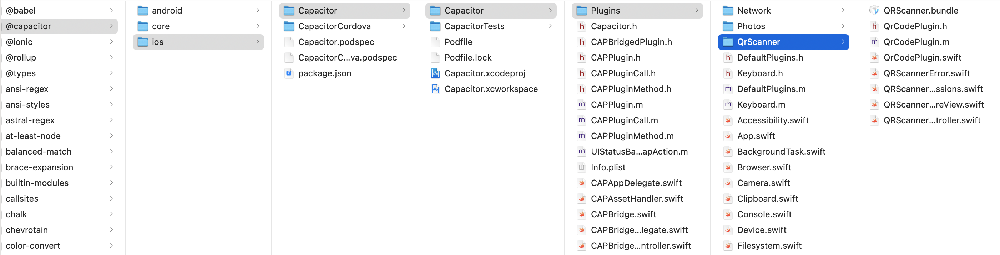

# capacitor-qr-scanner
A QR Code scanner for Android and iOS using Capacitor

### iOS：

##### Step 1: QrCodePlugin file in path:
  (copy this file to your project same path;)
  
```
capacitor-qr-scanner/node_modules/@capacitor/ios/Capacitor/Capacitor/Plugins/QrScanner
```
<!---->
<div align=center>

</div>


##### Step 2: add QrCodePlugin to your iOS Project with below operations;
######  a.open your ios project:
<div align=center>
    
</div> 

###### b. add QrCodePlugin file:(path : node_modules/@capacitor/ios/Capacitor/Capacitor/Plugins/QrScanner)
<div align=center>
    
</div> 
 <div align=center>
    
</div> 

show like this , add Success;
<div align=center>
    
</div> 

###### c. info.plist anth:
    check your info.plist file, if there is not 'Privacy - Camera Usage Description' exist;
    add 'NSCameraUsageDescription' with String like below;

<div align=center>
    
</div> 

###### d. Web excute ios method:
 
 <div align=center>
    
</div>   

###### e. Teminal excute order:
    
```
npx ionic capacitor copy ios
```

###### f. iOS rebuild and run app in your mobile(not support Simulator):

Any Questions Contact me!
